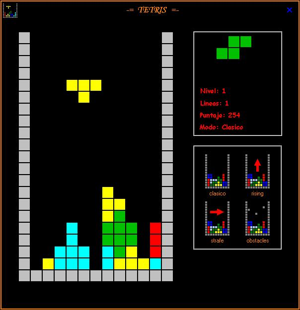



## JCG Tetris

### Description

This is my version of the clasic Tetris. Again.. no api's, no dll's, just pure vb. To keep it simple :D

NOTE: You have 4 playing modes !
 
### More Info
 

             |
---                |---
**Submitted On**   |2006-10-17 21:21:18
**By**             |[Julio C\. Gotuzzo](https://github.com/Planet-Source-Code/PSCIndex/blob/master/ByAuthor/julio-c-gotuzzo.md)
**Level**          |Advanced
**User Rating**    |5.0 (10 globes from 2 users)
**Compatibility**  |VB 6\.0
**Category**       |[Complete Applications](https://github.com/Planet-Source-Code/PSCIndex/blob/master/ByCategory/complete-applications__1-27.md)
**World**          |[Visual Basic](https://github.com/Planet-Source-Code/PSCIndex/blob/master/ByWorld/visual-basic.md)
**Archive File**   |[JCG\_Tetris20261610202006\.zip](https://github.com/Planet-Source-Code/julio-c-gotuzzo-jcg-tetris__1-66840/archive/master.zip)

